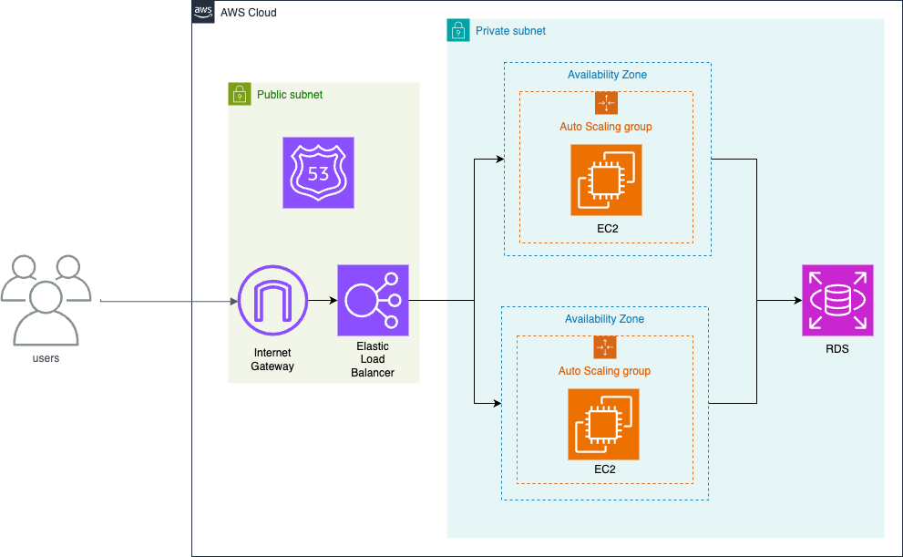

# AI Reversi

AI Reversiでは、さまざまな強さなAIを相手にリバーシをプレイすることができます。さらに、リプレイ機能を使って自分の過去の対戦の内容を振り返ったり、メモを付けたりすることができます。自分のこれまでの対戦結果はダッシュボードでいつでも確認することができます。

## デモ

[AI Reversi Webサイト](https://ai-reversi.com)


## 技術スタック

- **フロントエンド**: JavaScript
- **バックエンド**: Django (Python), PostgreSQL
- **Webサーバー**: Nginx, Gunicorn
- **クラウド**: AWS (EC2, RDS, ELB, CloudFormation)
- **コンテナ化**: Docker
- **CI**: GitHub Actions

## 特徴と機能

- さまざまな強さのAIとの対戦
    - Very Easy: ランダムな手を選択するAI
    - Easy: 次の1手のみを読み、最も多くの石をひっくり返すことができる手を選択するAI
    - Medium: 6手先（最後の10手は全ての手）まで読み、[Minimax法](https://en.wikipedia.org/wiki/Minimax)によって最適な手を選択するAI
- 過去のゲームのリプレイ機能
    - 最新10件（会員登録すると無制限）のゲームを保存、対戦内容をリプレイで見ることができる
    - リプレイ画面では自動再生のほか、次の手や一つ前の手を直感的にボタンを操作して見ることができるほか、手の一覧画面をクリックするとその手に飛ぶことが可能
    - 会員登録した場合は各ゲームのタイトルやメモを作成することが可能
    - 会員登録した場合はゲームのお気に入り登録も可能
- ユーザーダッシュボード
- レスポンシブデザイン

## アーキテクチャ



## ローカルでWebサイトを表示する場合の手順

- Docker DesktopおよびDocker Composeのインストール
    - [Docker Desktop](https://docs.docker.com/desktop/)
    - [Docker Compose](https://docs.docker.jp/v1.12/compose/install.html)

- Dockerデーモン（サーバー）を立ち上げます。

- レポジトリをクローンします。
```
git clone git@github.com:ryok247/ai-reversi.git
cd ai-reversi
```

- .envファイルを作成し、ルートディレクトリ直下に置きます。.envファイルには例えば以下のような内容を書きます。
```
SECRET_KEY=<your-secret-key>

DEBUG=True

LOCAL=True

ALLOWED_HOST1=*

RDS_HOSTNAME=

# PostgreSQL Server Settings
POSTGRES_USER=<postgres-user>
POSTGRES_PASSWORD=<postgres-password>
POSTGRES_DB=<postgres-db>

# DB Settings
DB_NAME=<db-name>
DB_USER=<db-user>
DB_PASSWORD=<db-password>
DB_PORT=5432
```

- docker-composeコマンドでローカルサーバーを立ち上げます。
```
docker-compose -f docker-compose.dev.yml build --no-cache
docker-compose -f docker-compose.dev.yml up
```

- ローカルホスト（http://127.0.0.1:8000/）にアクセスするとWebサイトが表示されます。

## ライセンス

このプロジェクトはMITライセンスのもとで公開されています。
