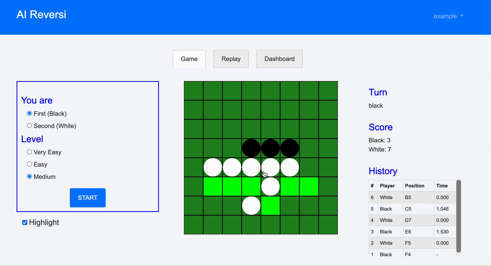
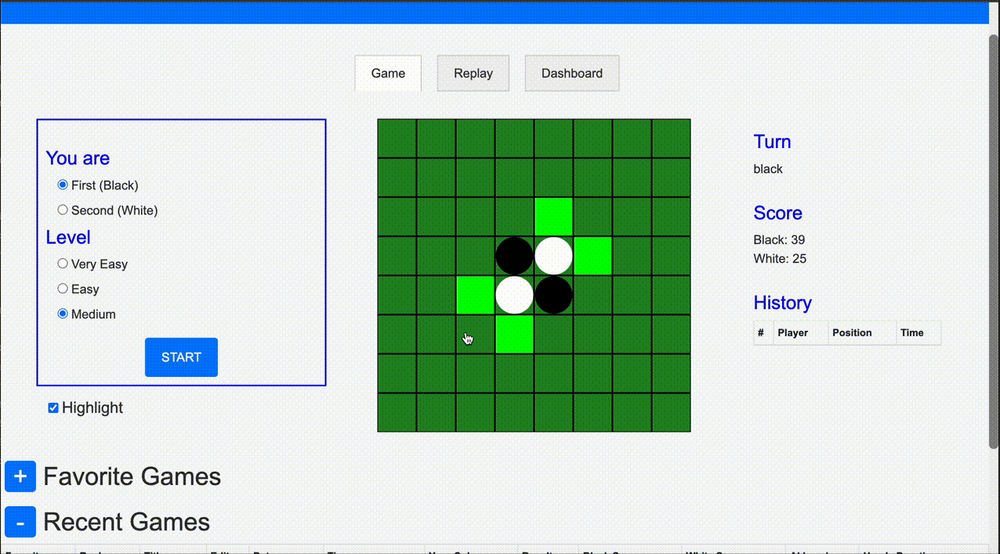

# AI Reversi

[日本語で読む](README_JA.md)

With AI Reversi, you can play Reversi against AIs of various difficulties. Additionally, you can use the replay feature to review your past games, add notes, and check your game history on the dashboard at any time.

## Demo

Visit the [AI Reversi Website](https://ai-reversi.com)

### Game Screen


### Replay Screen


## Tech Stack

- **Frontend**: JavaScript
- **Backend**: Django (Python), PostgreSQL
- **Web Server**: Nginx, Gunicorn
- **Cloud Platform**: AWS (EC2, RDS, ELB)
- **Containerization**: Docker, Docker Compose
- **CI/CD**: GitHub Actions, OpenID Connect (OIDC)
- **Infrastructure as Code (IaC)**: AWS CloudFormation

## Features

- Compete against AIs with different levels of difficulty:
    - Very Easy: AI that selects moves randomly.
    - Easy: AI that reads one move ahead and chooses the move that flips the most pieces.
    - Medium: AI that reads up to 6 moves ahead (all moves for the last 10 moves) and selects the best move using [Minimax algorithm](https://en.wikipedia.org/wiki/Minimax).
- Replay past games feature:
    - Save and replay the last 10 games (unlimited for registered users).
    - In the replay screen, you can automatically play, move to the next or previous move by buttons, and jump to any move by clicking on the move list.
    - Registered users can create titles and notes for each game.
    - Registered users can also favorite games.
- User dashboard
- Responsive design

## Architecture


## Running the Website Locally

- Install Docker Desktop and Docker Compose:
    - [Docker Desktop](https://docs.docker.com/desktop/)
    - [Docker Compose](https://docs.docker.jp/v1.12/compose/install.html)

- Start the Docker daemon (server).

- Clone the repository:
```
git clone git@github.com:ryok247/ai-reversi.git
cd ai-reversi
```

- Create a .env file and place it directly under the root directory. The .env file should contain something like the following:
```
SECRET_KEY=<your-secret-key>

DEBUG=True

LOCAL=True

ALLOWED_HOST1=*

RDS_HOSTNAME=

# PostgreSQL Server Settings
POSTGRES_USER=<postgres-user>
POSTGRES_PASSWORD=<postgres-password>
POSTGRES_DB=<postgres-db>

# DB Settings
DB_NAME=<db-name>
DB_USER=<db-user>
DB_PASSWORD=<db-password>
DB_PORT=5432
```

- Use the docker-compose command to launch the local server:
```
docker-compose -f docker-compose.dev.yml build --no-cache
docker-compose -f docker-compose.dev.yml up
```

- Access the website at http://127.0.0.1:8000/.

## Licence

This project is released under the MIT License.