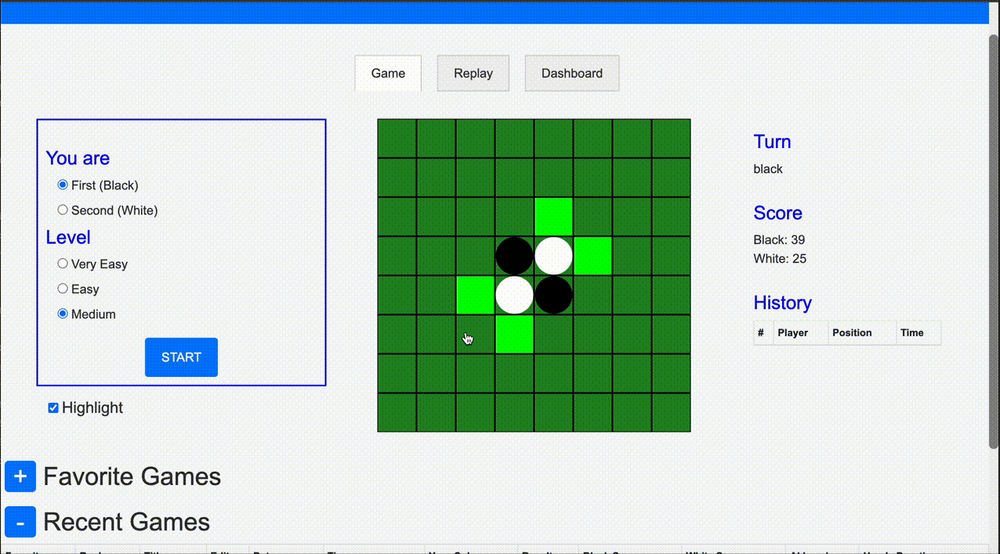
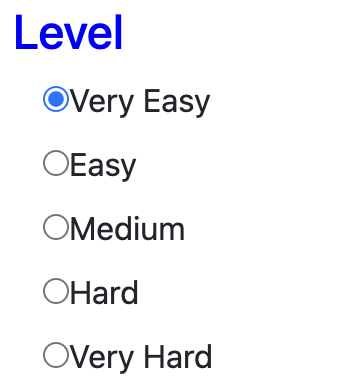
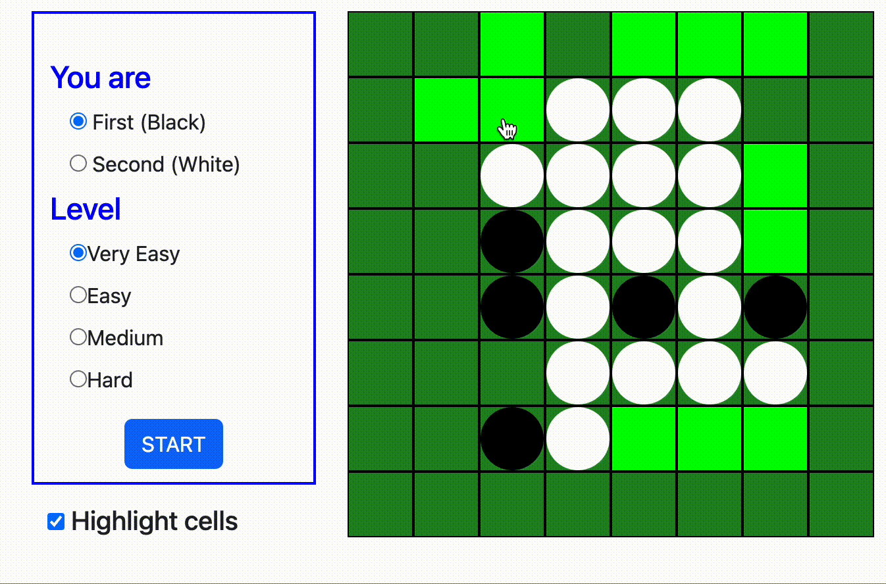
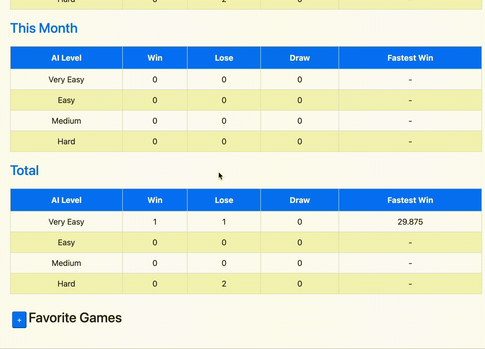
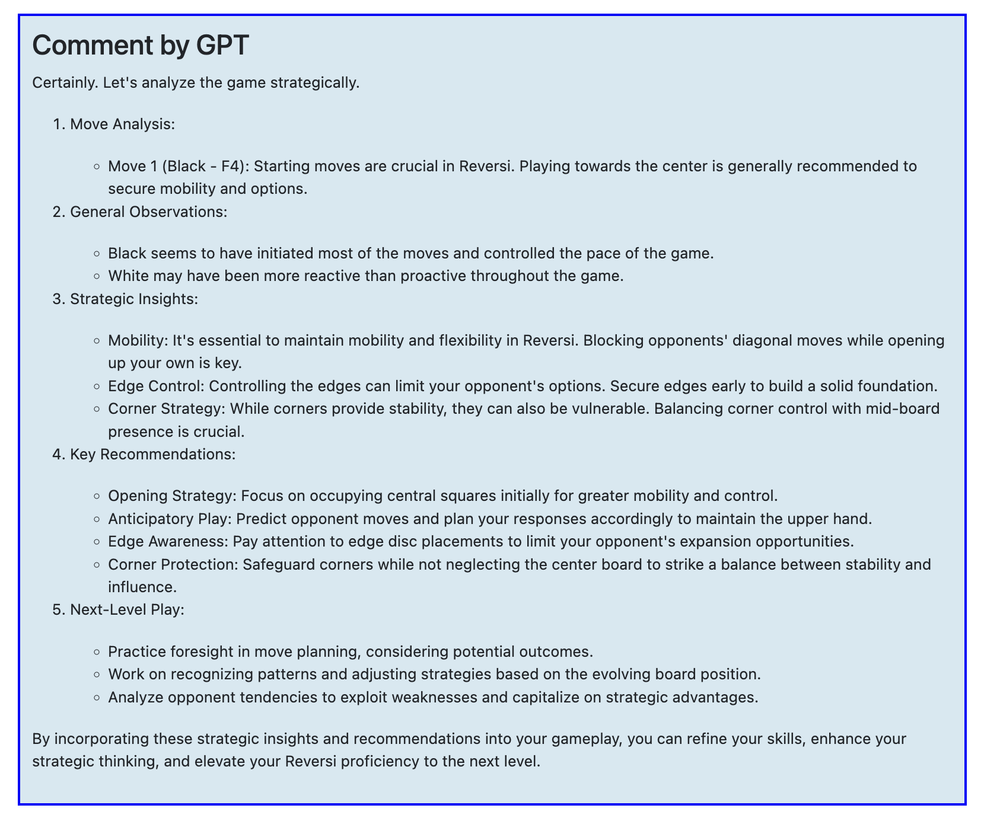
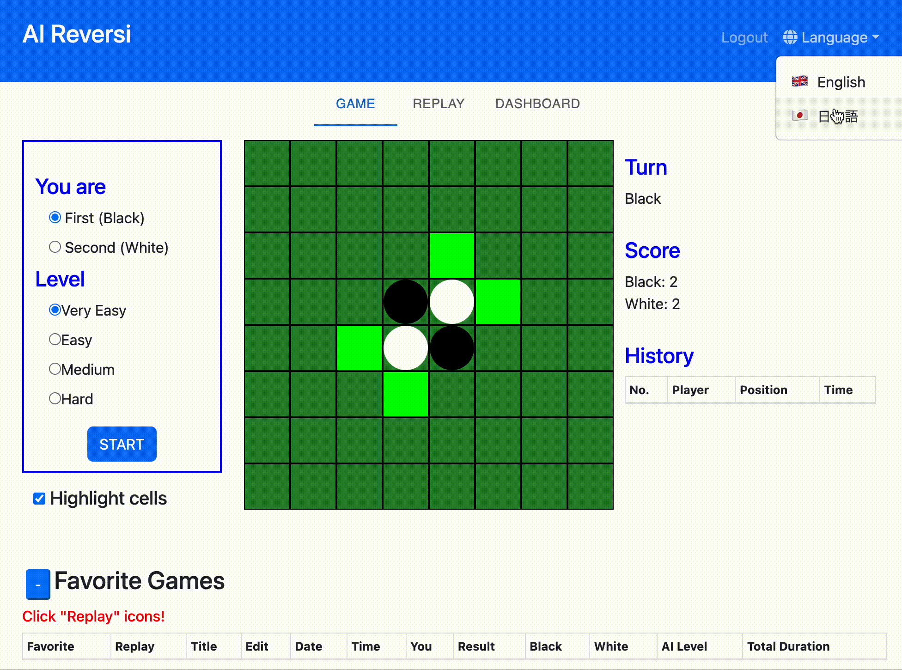
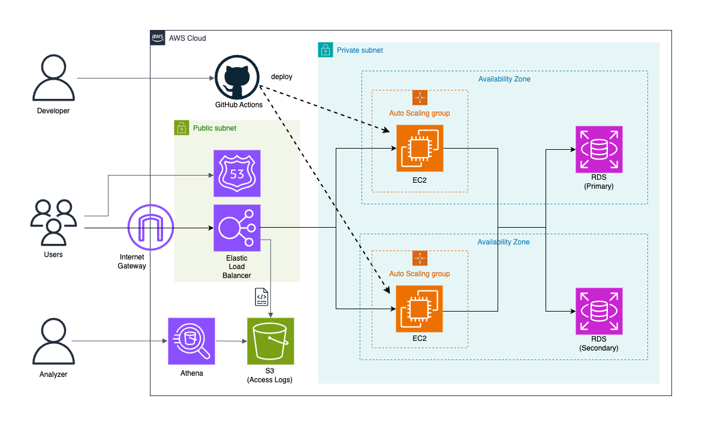
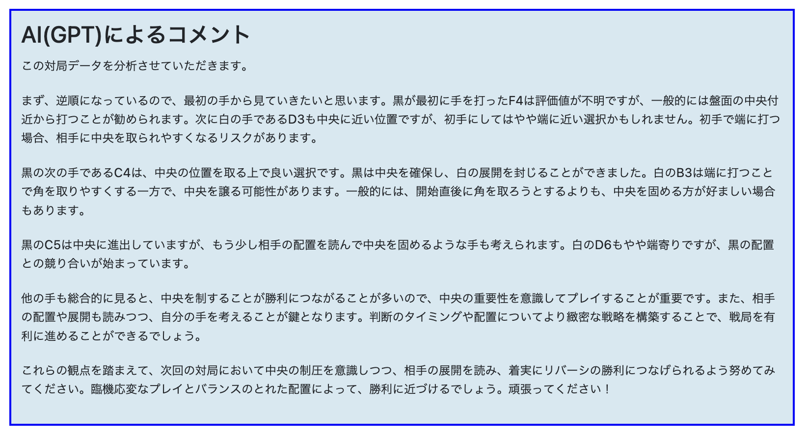

# AI Reversi

[日本語で読む](#ai-reversi-1)

With AI Reversi, you can play Reversi against AIs of various difficulties. Additionally, you can use the replay feature to review your past games, add notes, and check your game history on the dashboard at any time.

## Demo

Visit the [AI Reversi Website](https://ai-reversi.com)

### Game Screen


### Replay Screen


## Tech Stack

| Category               | Technologies                                                |
| ---------------------- | ----------------------------------------------------------- |
|Frontend                |	React v18.2.0, JavaScript (Node.js v18.15.0 / npm v9.5.0)  |
|Backend                 |	Django v4.2.7 (Python v3.12.1), PostgreSQL v16.1 (Debian 16.1-1.pgdg120+1)|
|Testing                 |	Jest v29.7.0 (JavaScript testing), Django's default testing framework (Django v4.2.7)|
|Web Server	             |  Nginx v1.18.0, Gunicorn v21.2.0                            |
|Authentication          |	Custom user model in Django for authentication             |
|Cloud                   |	AWS (EC2, RDS, ELB)                                        |
|Security & Infrastructure|	HTTPS enabled with SSL/TLS certificates by AWS Certificate Manager (ACM)|
|Containerization        |	Docker v20.10.11, Docker Compose v1.29.2                   |
|CI/CD                   |	GitHub Actions, OpenID Connect (OIDC)                      |
|Infrastructure as Code  |	Terraform v1.7.3, AWS CloudFormation                       |
|Log Management & Analysis|	ELB access logs stored in S3 bucket and analyzed with Amazon Athena|
|External API            |	OpenAI API v1 (Chat Completion)                            |

## Features and Functions

<table>
    <tr>
        <td>
            
        </td>
        <td width="200">
            <h3>AI Strength</h3>
            Very Easy: AI that chooses moves randomly.
            <br>Easy: Reads only the next move and selects the move that flips the most stones.
            <br>Medium: Reads up to 6 moves ahead (the last 10 moves are all read), selecting the optimal move using the <a href="https://en.wikipedia.org/wiki/Minimax">Minimax method</a>.
        </td>
        <td>
            
        </td>
        <td width="200">
            Hard: Compete against a deep learning model (CNN) trained with tens of thousands of data points. This model uses the same SL Policy Network as described in the <a href="https://www.nature.com/articles/nature16961">AlphaGo paper</a>.
        </td>
    </tr>
    <tr>
       <td>
            
        </td>
        <td width="200">
            <h3>Replay Feature</h3>
            You can view replays of current matches. In addition to automatic replays, you can fast forward or rewind one move at a time.
        </td>
        <td>
            
        </td>
        <td width="200">
            In the replay screen, you can also recreate any board position with a single click.
        </td>
    </tr>
    <tr>
        <td>
            
        </td>
        <td width="200">
            <h3>Highlight Feature</h3>
            You can change the color of squares where stones can be placed.
        </td>
        <td>
            
        </td>
        <td width="200">
            <h3>History Feature</h3>
            Displays a list of moves made so far and updates in real-time.
        </td>
    </tr>
    <tr>
        <td>
            
        </td>
        <td width="200">
            <h3>Dashboard (Members Only)</h3>
            You can view user performance over different periods.
        </td>
        <td>
            
        </td>
        <td width="200">
            <h3>Favorites Feature (Members Only)</h3>
            You can favorite past matches and assign your own titles to them.
        </td>
    </tr>
    <tr>
        <td>
            
        </td>
        <td width="200">
            <h3>AI Advice Feature</h3>
            AI (GPT) analyzes past matches and offers advice for improvement.
        </td>
        <td>
            
        </td>
        <td width="200">
            Supports both English and Japanese languages.
        </td>
    </tr>
    <tr>
        <td>
            
        </td>
        <td width="200">
            <h3>Responsive Design</h3>
            You can play seamlessly from mobile devices.
        </td>
        <td width="200">
        </td>
        <td width="200">
        </td>
    </tr>
</table>


## Architecture



| Component          | Description |
|--------------------|----------------------------------------------------------------------------------------------------------------------------------------|
| Users               | End-users of the system who access the service via a web browser.                                                                                             |
| Developers               | Individuals responsible for developing and operating the system. They deploy code changes via GitHub Actions.                                                                                 |
| Analysts               | Individuals responsible for analyzing data such as logs. They use Amazon Athena to analyze log data stored in S3.                                                                               |
| Internet Gateway    | Mediates communication between the internet and the VPC.                                                                                                           |
| ELB (Elastic Load Balancer) | Distributes traffic across EC2 instances to evenly spread the load. Also provides SSL support.                                                                          |
| Auto Scaling        | Automatically scales the number of EC2 instances up or down depending on the load.                                                                                                  |
| EC2 (Amazon Elastic Compute Cloud) | Runs Nginx and Gunicorn servers in cooperation on Docker containers.                                                                                              |
| RDS (Amazon Relational Database Service) | Uses PostgreSQL. Supports Multi-AZ, with the Secondary as a read-only replica of the Primary.                                                                                   |
| S3 (Access Logs)     | Automatically stores ELB access logs.                                                                                                           |

## Running the Website Locally

- Install Docker Desktop and Docker Compose:
    - [Docker Desktop](https://docs.docker.com/desktop/)
    - [Docker Compose](https://docs.docker.jp/v1.12/compose/install.html)

- Start the Docker daemon (server).

- Clone the repository:
```
git clone git@github.com:ryok247/ai-reversi.git
cd ai-reversi
```

- Create a .env file and place it directly under the root directory. The .env file should contain something like the following:
```
SECRET_KEY=<your-secret-key>

DEBUG=True

LOCAL=True

ALLOWED_HOST1=*

RDS_HOSTNAME=

# PostgreSQL Server Settings
POSTGRES_USER=<postgres-user>
POSTGRES_PASSWORD=<postgres-password>
POSTGRES_DB=<postgres-db>

# DB Settings
DB_NAME=<db-name>
DB_USER=<db-user>
DB_PASSWORD=<db-password>
DB_PORT=5432

# OpenAI API
OPENAI_API_KEY=<openai-api-key>
```

- Use the docker-compose command to launch the local server:
```
docker-compose -f docker-compose.dev.yml build --no-cache
docker-compose -f docker-compose.dev.yml up
```

- Access the website at http://127.0.0.1:8000/.

## Licence

This project is released under the [MIT License](LICENSE).


# AI Reversi

[Read in English](#ai-reversi)

AI Reversiでは、さまざまな強さなAIを相手にリバーシをプレイすることができます。さらに、リプレイ機能を使って自分の過去の対戦の内容を振り返ったり、メモを付けたりすることができます。自分のこれまでの対戦結果はダッシュボードでいつでも確認することができます。

## デモ

[AI Reversi Webサイト](https://ai-reversi.com)

### ゲーム画面


### リプレイ画面


## 技術スタック

| 分類                   | 技術                                                        |
| ---------------------- | ----------------------------------------------------------- |
|フロントエンド            |    React v18.2.0, JavaScript (Node.js v18.15.0 / npm v9.5.0)|
|バックエンド              |	Django v4.2.7 (Python v3.12.1), PostgreSQL v16.1 (Debian 16.1-1.pgdg120+1)|
|テスティング              |	Jest v29.7.0 (JavaScriptのテスト), Djangoのデフォルトテストフレームワーク (Django v4.2.7)|
|Webサーバー              |	    Nginx v1.18.0, Gunicorn v21.2.0|
|認証                     |     Djangoのカスタムユーザーモデルを使用した認証システム|
|クラウド                 |	    AWS (EC2, RDS, ELB)|
|セキュリティとインフラ      |	    AWS Certificate Manager (ACM) によるSSL/TLS証明書を使用したHTTPS化|
|コンテナ化                |	Docker v20.10.11, Docker Compose v1.29.2|
|CI/CD                   |	GitHub Actions, OpenID Connect (OIDC)|
|Infrastructure as Code  |	Terraform v1.7.3, AWS CloudFormation|
|ログ管理と分析            |	AWS ELBのアクセスログをS3バケットに保存し、Amazon Athenaで分析|
|外部API                  |	OpenAI API v1 (Chat Completion)|

## 特徴と機能

<table>
    <tr>
        <td>
            
        </td>
        <td width="200">
            <h3>AIの強さ</h3>
            Very Easy: ランダムな手を選択するAI
            <br>Easy: 次の1手のみを読み、最も多くの石をひっくり返すことができる手を選択するAI
            <br>Medium: 6手先（最後の10手は全ての手）まで読み、<a href="https://en.wikipedia.org/wiki/Minimax">Minimax法</a>によって最適な手を選択するAI
        </td>
        <td>
            
        </td>
        <td width="200">
            Hard: 数万もの学習データを用いて訓練したディープラーニングモデル(CNN)と対戦することができます。このモデルは<a href="https://www.nature.com/articles/nature16961">Alpha Goの論文</a>で使われているSL Policy Networkと同じものです。
        </td>
    </tr>
    <tr>
       <td>
            
        </td>
        <td width="200">
            <h3>リプレイ機能</h3>
            現在の対局のリプレイを見ることができます。自動リプレイのほか、１手ずつ先送りしたり巻き戻したりできます。
        </td>
        <td>
            
        </td>
        <td width="200">
            また、リプレイ画面では、任意の手番の盤面を１クリックで再現することができます。
        </td>
    </tr>
    <tr>
        <td>
            
        </td>
        <td width="200">
            <h3>ハイライト機能</h3>
            石を置けるマスの色を変えることができます。
        </td>
        <td>
            
        </td>
        <td width="200">
            <h3>履歴機能</h3>
            今まで打った手の一覧が表示され、随時更新されます。
        </td>
    </tr>
    <tr>
        <td>
            
        </td>
        <td width="200">
            <h3>ダッシュボード（会員限定機能）</h3>
            ユーザーの期間ごとの成績を見ることができます。
        </td>
        <td>
            
        </td>
        <td width="200">
            <h3>お気に入り機能（会員限定機能）</h3>
            過去の対局をお気に入りに登録したり、自分の好きなタイトルをつけることができます。
        </td>
    </tr>
    <tr>
        <td>
            
        </td>
        <td width="200">
            <h3>AIアドバイス機能</h3>
            過去の対局に対してAI(GPT)が分析をしたり、改善点をアドバイスしたりしてくれます。
        </td>
        <td>
            
        </td>
        <td width="200">
            英語と日本語の２言語に対応しています。
        </td>
    </tr>
    <tr>
        <td>
            
        </td>
        <td width="200">
            <h3>レスポンシブデザイン</h3>
            モバイルからもストレスなくプレイできます。
        </td>
        <td width="200">
        </td>
        <td width="200">
        </td>
    </tr>
</table>

## アーキテクチャ


| コンポーネント          | 説明 |
|----------------------|----------------------------------------------------------------------------------------------------------------------------------------|
| ユーザー               | システムのエンドユーザー。Webブラウザを通じてサービスにアクセスします。                                                                                             |
| 開発者               | システムの開発と運用を行う担当者。GitHub Actionsを介してコードの変更をデプロイします。                                                                                 |
| 分析者               | ログデータなどを分析する担当者。Amazon Athenaを使用してS3に保存されたログデータを解析します。                                                                               |
| Internet Gateway    | インターネットとVPCとの間で通信を仲介します。                                                                                                           |
| ELB (Elastic Load Balancer) | トラフィックをEC2インスタンスに分散することで、負荷を均等に分けます。またSSLを提供する役割も持ちます。                                                                          |
| Auto Scaling        | 負荷に応じてEC2インスタンスの数を自動的にスケールアップ・ダウンします。                                                                                                  |
| EC2 (Amazon Elastic Compute Cloud) | Dockerコンテナ上でNginxとGunicornの２つのサーバーが協調して動作します。                                                                                              |
| RDS (Amazon Relational Database Service) | PostgreSQLを使用。Multi-AZに対応し、SecondaryはPrimaryのレプリカ（読み取り専用）です。                                                                                   |
| S3 (Access Logs)     | ELBのアクセスログが自動でここに保存されます。                                                                                                           |

## ローカルでWebサイトを表示する場合の手順

- Docker DesktopおよびDocker Composeのインストール
    - [Docker Desktop](https://docs.docker.com/desktop/)
    - [Docker Compose](https://docs.docker.jp/v1.12/compose/install.html)

- Dockerデーモン（サーバー）を立ち上げます。

- レポジトリをクローンします。
```
git clone git@github.com:ryok247/ai-reversi.git
cd ai-reversi
```

- .envファイルを作成し、ルートディレクトリ直下に置きます。.envファイルには例えば以下のような内容を書きます。
```
SECRET_KEY=<your-secret-key>

DEBUG=True

LOCAL=True

ALLOWED_HOST1=*

RDS_HOSTNAME=

# PostgreSQL Server Settings
POSTGRES_USER=<postgres-user>
POSTGRES_PASSWORD=<postgres-password>
POSTGRES_DB=<postgres-db>

# DB Settings
DB_NAME=<db-name>
DB_USER=<db-user>
DB_PASSWORD=<db-password>
DB_PORT=5432
```

- docker-composeコマンドでローカルサーバーを立ち上げます。
```
docker-compose -f docker-compose.dev.yml build --no-cache
docker-compose -f docker-compose.dev.yml up
```

- ローカルホスト（ http://127.0.0.1:8000/ ）にアクセスするとWebサイトが表示されます。

## ライセンス

このプロジェクトは[MITライセンス](LICENSE)のもとで公開されています。
