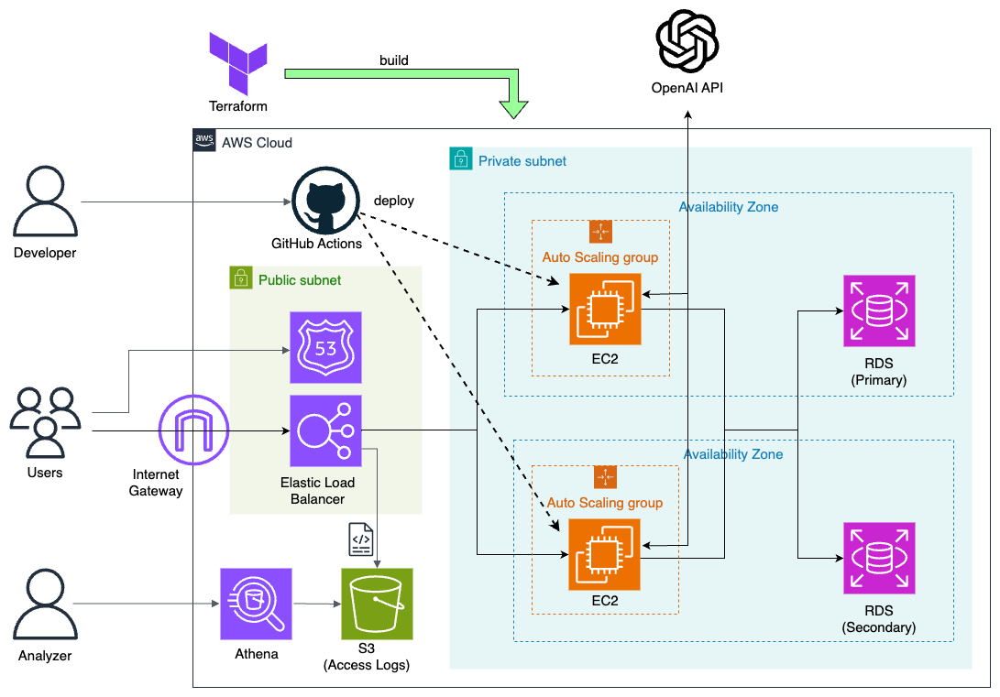

# AI Reversi

[日本語で読む](#ai-reversi-1)

With AI Reversi, you can play Reversi against AIs of various difficulties. Additionally, you can use the replay feature to review your past games, add notes, and check your game history on the dashboard at any time.

## Demo

Visit the [AI Reversi Website](https://ai-reversi.com)

### Game Screen


### Replay Screen


## Tech Stack

| Category               | Technologies                                                |
| ---------------------- | ----------------------------------------------------------- |
| Frontend               | JavaScript (Node.js v18.15.0 / npm v9.5.0)                  |
| Backend                | Django v4.2.7 (Python v3.12.1), PostgreSQL v16.1 (Debian 16.1-1.pgdg120+1) |
| Testing                | Jest v29.7.0 (for JavaScript testing), Django's default test framework (Django v4.2.7) |
| Web Server             | Nginx v1.18.0, Gunicorn v21.2.0                             |
| Authentication         | Custom User Model with Django's authentication system       |
| Cloud Platform         | AWS (EC2, RDS, ELB)                                         |
| Security and Infrastructure | HTTPS enabled via AWS Certificate Manager (ACM) for SSL/TLS certificates |
| Containerization       | Docker v20.10.11, Docker Compose v1.29.2                    |
| CI/CD                  | GitHub Actions (actions/checkout@v2, actions/setup-python@v2, actions/setup-node@v1, aws-actions/configure-aws-credentials@v1, webfactory/ssh-agent@v0.5.3), OpenID Connect (OIDC) |
| Infrastructure as Code (IaC) | AWS CloudFormation                                        |
| Logging and Analysis   | Automatically save AWS Elastic Load Balancer (ELB) access logs to Amazon S3 buckets, with Amazon Athena used for on-demand log data analysis |

## Features

- Compete against AIs with different levels of difficulty:
    - Very Easy: AI that selects moves randomly.
    - Easy: AI that reads one move ahead and chooses the move that flips the most pieces.
    - Medium: AI that reads up to 6 moves ahead (all moves for the last 10 moves) and selects the best move using [Minimax algorithm](https://en.wikipedia.org/wiki/Minimax).
- Replay past games feature:
    - Save and replay the last 10 games (unlimited for registered users).
    - In the replay screen, you can automatically play, move to the next or previous move by buttons, and jump to any move by clicking on the move list.
    - Registered users can create titles and notes for each game.
    - Registered users can also favorite games.
- User dashboard
- Responsive design

## Architecture



| Component          | Description |
|--------------------|----------------------------------------------------------------------------------------------------------------------------------------|
| Users               | End-users of the system who access the service via a web browser.                                                                                             |
| Developers               | Individuals responsible for developing and operating the system. They deploy code changes via GitHub Actions.                                                                                 |
| Analysts               | Individuals responsible for analyzing data such as logs. They use Amazon Athena to analyze log data stored in S3.                                                                               |
| Internet Gateway    | Mediates communication between the internet and the VPC.                                                                                                           |
| ELB (Elastic Load Balancer) | Distributes traffic across EC2 instances to evenly spread the load. Also provides SSL support.                                                                          |
| Auto Scaling        | Automatically scales the number of EC2 instances up or down depending on the load.                                                                                                  |
| EC2 (Amazon Elastic Compute Cloud) | Runs Nginx and Gunicorn servers in cooperation on Docker containers.                                                                                              |
| RDS (Amazon Relational Database Service) | Uses PostgreSQL. Supports Multi-AZ, with the Secondary as a read-only replica of the Primary.                                                                                   |
| S3 (Access Logs)     | Automatically stores ELB access logs.                                                                                                           |

## Running the Website Locally

- Install Docker Desktop and Docker Compose:
    - [Docker Desktop](https://docs.docker.com/desktop/)
    - [Docker Compose](https://docs.docker.jp/v1.12/compose/install.html)

- Start the Docker daemon (server).

- Clone the repository:
```
git clone git@github.com:ryok247/ai-reversi.git
cd ai-reversi
```

- Create a .env file and place it directly under the root directory. The .env file should contain something like the following:
```
SECRET_KEY=<your-secret-key>

DEBUG=True

LOCAL=True

ALLOWED_HOST1=*

RDS_HOSTNAME=

# PostgreSQL Server Settings
POSTGRES_USER=<postgres-user>
POSTGRES_PASSWORD=<postgres-password>
POSTGRES_DB=<postgres-db>

# DB Settings
DB_NAME=<db-name>
DB_USER=<db-user>
DB_PASSWORD=<db-password>
DB_PORT=5432
```

- Use the docker-compose command to launch the local server:
```
docker-compose -f docker-compose.dev.yml build --no-cache
docker-compose -f docker-compose.dev.yml up
```

- Access the website at http://127.0.0.1:8000/.

## Licence

This project is released under the [MIT License](LICENSE).


# AI Reversi

[Read in English](#ai-reversi)

AI Reversiでは、さまざまな強さなAIを相手にリバーシをプレイすることができます。さらに、リプレイ機能を使って自分の過去の対戦の内容を振り返ったり、メモを付けたりすることができます。自分のこれまでの対戦結果はダッシュボードでいつでも確認することができます。

## デモ

[AI Reversi Webサイト](https://ai-reversi.com)

### ゲーム画面


### リプレイ画面


## 技術スタック

| 分類                   | 技術                                                        |
| ---------------------- | ----------------------------------------------------------- |
| フロントエンド         | JavaScript (Node.js v18.15.0 / npm v9.5.0)                  |
| バックエンド           | Django v4.2.7 (Python v3.12.1), PostgreSQL v16.1 (Debian 16.1-1.pgdg120+1) |
| テスト                 | Jest v29.7.0 (JavaScriptのテスト), Djangoのデフォルトテストフレームワーク (Django v4.2.7) |
| Webサーバー            | Nginx v1.18.0, Gunicorn v21.2.0                             |
| 認証                   | Djangoのカスタムユーザーモデルを使用した認証システム         |
| クラウド               | AWS (EC2, RDS, ELB)                                         |
| セキュリティとインフラ | AWS Certificate Manager (ACM) によるSSL/TLS証明書でHTTPS有効化 |
| コンテナ化             | Docker v20.10.11, Docker Compose v1.29.2                    |
| CI/CD                  | GitHub Actions (actions/checkout@v2, actions/setup-python@v2, actions/setup-node@v1, aws-actions/configure-aws-credentials@v1, webfactory/ssh-agent@v0.5.3), OpenID Connect (OIDC) |
| IaC                    | AWS CloudFormation                                           |
| ログ管理と分析         | AWS Elastic Load Balancer (ELB) のアクセスログをS3バケットに保存し、Amazon Athenaを使用して解析 |

## 特徴と機能

- さまざまな強さのAIとの対戦
    - Very Easy: ランダムな手を選択するAI
    - Easy: 次の1手のみを読み、最も多くの石をひっくり返すことができる手を選択するAI
    - Medium: 6手先（最後の10手は全ての手）まで読み、[Minimax法](https://en.wikipedia.org/wiki/Minimax)によって最適な手を選択するAI
- 過去のゲームのリプレイ機能
    - 最新10件（会員登録すると無制限）のゲームを保存、対戦内容をリプレイで見ることができる
    - リプレイ画面では自動再生のほか、次の手や一つ前の手を直感的にボタンを操作して見ることができるほか、手の一覧画面をクリックするとその手に飛ぶことが可能
    - 会員登録した場合は各ゲームのタイトルやメモを作成することが可能
    - 会員登録した場合はゲームのお気に入り登録も可能
- ユーザーダッシュボード
- レスポンシブデザイン

## アーキテクチャ


| コンポーネント          | 説明 |
|----------------------|----------------------------------------------------------------------------------------------------------------------------------------|
| ユーザー               | システムのエンドユーザー。Webブラウザを通じてサービスにアクセスします。                                                                                             |
| 開発者               | システムの開発と運用を行う担当者。GitHub Actionsを介してコードの変更をデプロイします。                                                                                 |
| 分析者               | ログデータなどを分析する担当者。Amazon Athenaを使用してS3に保存されたログデータを解析します。                                                                               |
| Internet Gateway    | インターネットとVPCとの間で通信を仲介します。                                                                                                           |
| ELB (Elastic Load Balancer) | トラフィックをEC2インスタンスに分散することで、負荷を均等に分けます。またSSLを提供する役割も持ちます。                                                                          |
| Auto Scaling        | 負荷に応じてEC2インスタンスの数を自動的にスケールアップ・ダウンします。                                                                                                  |
| EC2 (Amazon Elastic Compute Cloud) | Dockerコンテナ上でNginxとGunicornの２つのサーバーが協調して動作します。                                                                                              |
| RDS (Amazon Relational Database Service) | PostgreSQLを使用。Multi-AZに対応し、SecondaryはPrimaryのレプリカ（読み取り専用）です。                                                                                   |
| S3 (Access Logs)     | ELBのアクセスログが自動でここに保存されます。                                                                                                           |

## ローカルでWebサイトを表示する場合の手順

- Docker DesktopおよびDocker Composeのインストール
    - [Docker Desktop](https://docs.docker.com/desktop/)
    - [Docker Compose](https://docs.docker.jp/v1.12/compose/install.html)

- Dockerデーモン（サーバー）を立ち上げます。

- レポジトリをクローンします。
```
git clone git@github.com:ryok247/ai-reversi.git
cd ai-reversi
```

- .envファイルを作成し、ルートディレクトリ直下に置きます。.envファイルには例えば以下のような内容を書きます。
```
SECRET_KEY=<your-secret-key>

DEBUG=True

LOCAL=True

ALLOWED_HOST1=*

RDS_HOSTNAME=

# PostgreSQL Server Settings
POSTGRES_USER=<postgres-user>
POSTGRES_PASSWORD=<postgres-password>
POSTGRES_DB=<postgres-db>

# DB Settings
DB_NAME=<db-name>
DB_USER=<db-user>
DB_PASSWORD=<db-password>
DB_PORT=5432
```

- docker-composeコマンドでローカルサーバーを立ち上げます。
```
docker-compose -f docker-compose.dev.yml build --no-cache
docker-compose -f docker-compose.dev.yml up
```

- ローカルホスト（ http://127.0.0.1:8000/ ）にアクセスするとWebサイトが表示されます。

## ライセンス

このプロジェクトは[MITライセンス](LICENSE)のもとで公開されています。
